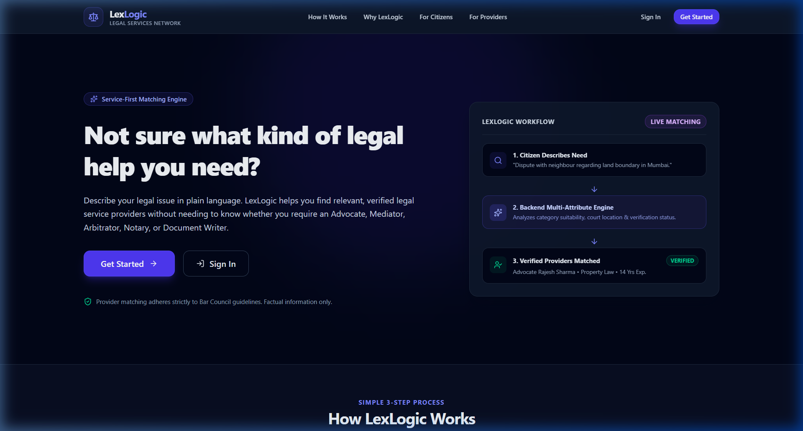
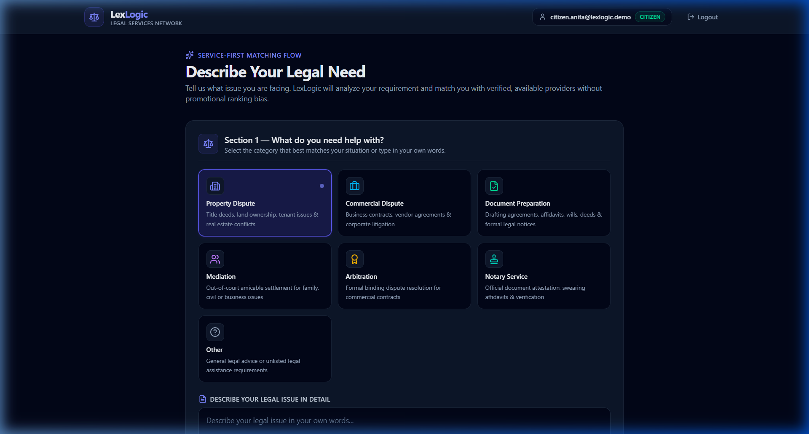
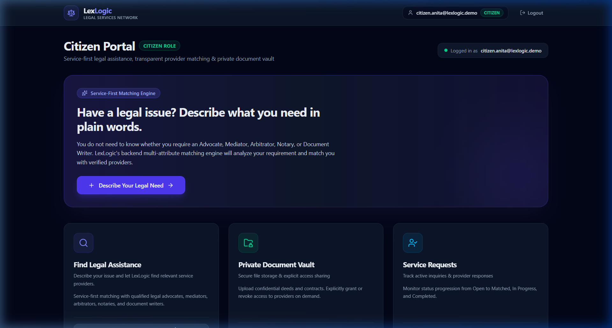
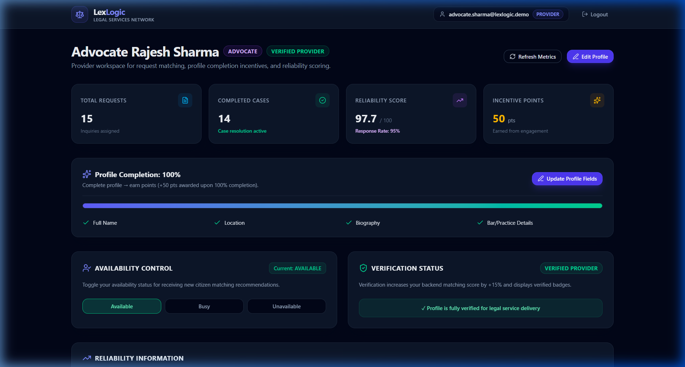
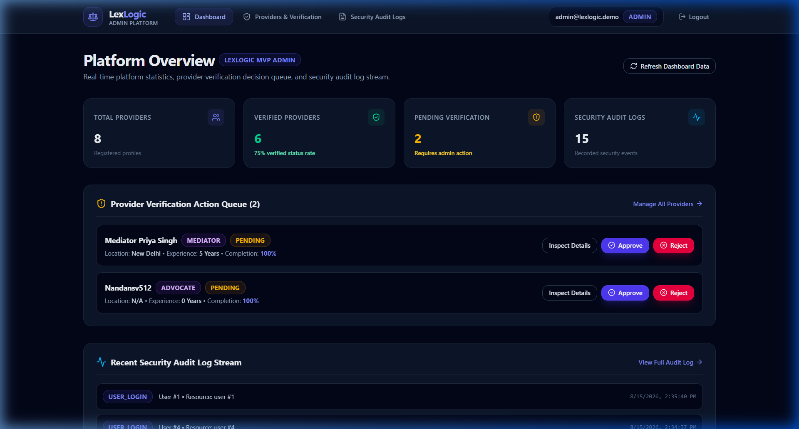
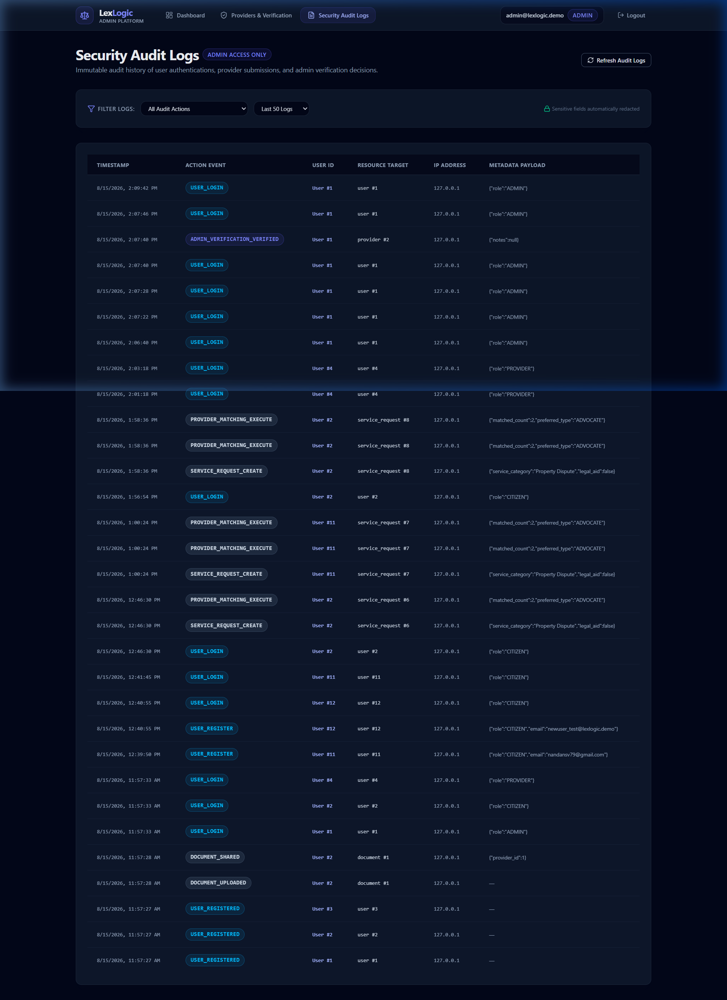

# LexLogic — Service-First Legal Access & Transparent Provider Matching Platform

[](https://fastapi.tiangolo.com/)
[](https://react.dev/)
[](https://www.typescriptlang.org/)
[](https://vitejs.dev/)
[](https://tailwindcss.com/)
[](https://www.sqlite.org/)
[](https://www.python.org/)
[]()
[]()

---

## ⚖️ Executive Summary

**LexLogic** is a modern, legal-tech platform designed to eliminate the guesswork from finding legal help.

Instead of requiring citizens to determine beforehand whether they need an **Advocate**, **Mediator**, **Arbitrator**, **Notary**, or **Document Writer**, citizens simply describe their legal situation in plain language. LexLogic's backend multi-attribute matching engine analyzes the requirement against court jurisdictions, provider specialties, verification credentials, and availability to return relevant, factual provider matches.

Matching strictly adheres to **Bar Council anti-promotional and non-commercialization standards** by displaying factual suitability parameters without sponsored rankings, paid ads, or commercial bidding.

---

## 🖼️ Application Preview

### Public Landing Page


### Citizen Portal & Legal Need Matching
| Service-First Need Creation | Multi-Attribute Provider Matching |
| :---: | :---: |
|  |  |

### Provider Portal & Performance Metrics


### Admin Verification & Security Audit Logs
| Platform Overview & Verification Queue | Security Audit Event Stream |
| :---: | :---: |
|  |  |

---

## 🌟 Key Features

### 👤 1. Citizen Portal
- **Service-First Flow**: Describe your issue without needing legal jargon or selecting specific lawyer categories.
- **Backend Matching Engine**: Multi-attribute algorithm evaluating category suitability, court location, experience, and verification.
- **Factual Match Breakdown**: Clear breakdown explaining *why* a provider matches your request.
- **Private Document Vault**: Private disk storage for confidential deeds and contracts.
- **Granular Share Control**: Explicitly share documents with specific providers and revoke access on demand.

### ⚖️ 2. Provider Portal
- **Dashboard & Performance Metrics**: Real-time tracking of assigned requests, completed cases, response rates, and reliability scores.
- **Profile Completion Incentive**: Gamified checklist with +50 points bonus upon 100% completion.
- **Availability Control Toggle**: Real-time status management (`AVAILABLE`, `BUSY`, `UNAVAILABLE`).
- **Eligible Requests Feed**: Real-time stream of citizen requests matching provider credentials.
- **Incentive Points Ledger**: Points earned from profile completion and prompt case resolutions.

### 🛡️ 3. Admin Portal
- **Platform Overview**: Live count of registered citizens, providers, verification queues, and active requests.
- **Bar Council Verification Inspection**: Factual credential review of Bar enrollment numbers, court experience, and decision actions (`VERIFIED` / `REJECTED`).
- **Security Audit Log Viewer**: Immutable audit log stream capturing authentications, document uploads, shares, revocations, and verification decisions.
- **Role-Based Access Control**: Strict role protection denying unauthorized access to non-admin accounts.

---

## 🔐 Document Access & Security Architecture

LexLogic implements strict security controls for confidential document management:

```text
[Citizen Upload] ──> Encrypted Disk Storage (Private)
       │
       ├── (Explicit Share Grant) ──> Provider Access Authorized (RBAC Stream)
       │
       └── (Revoke Access) ─────────> Provider Access Denied (403 Forbidden)
```

- **Private Disk Storage**: Uploaded files are stored outside web-accessible static paths.
- **Authenticated Streaming**: Files can only be streamed via `GET /api/documents/{id}` after JWT token verification.
- **Access Revocation**: When a citizen revokes access, any subsequent download attempt by the provider instantly fails with `403 Forbidden`.

---

## 🚀 Quickstart Guide

### Prerequisites
- **Python 3.10+** (Python 3.14 recommended)
- **Node.js 18+** & **npm**

---

### 1. Backend Setup

```bash
# Navigate to backend directory
cd backend

# Create virtual environment
python -m venv venv

# Activate virtual environment
# Windows:
.\venv\Scripts\activate
# Linux/macOS:
# source venv/bin/activate

# Install dependencies
pip install -r requirements.txt

# Reset and seed database with demo accounts
python -m app.seed --reset

# Run backend API server (runs on http://127.0.0.1:8000)
python -m uvicorn app.main:app --reload --port 8000
```

---

### 2. Frontend Setup

```bash
# Open a new terminal and navigate to frontend directory
cd frontend

# Install npm dependencies
npm install

# Start Vite development server (runs on http://localhost:5173)
npm run dev
```

---

## 🔑 Seeded Demo Credentials

| Role | Email | Password | Description |
| :--- | :--- | :--- | :--- |
| **Admin** | `admin@lexlogic.demo` | `Admin123!` | Platform oversight, verification registry & audit logs |
| **Citizen (Anita)** | `citizen.anita@lexlogic.demo` | `Citizen123!` | Citizen account for legal need submission & document vault |
| **Advocate (Sharma)** | `advocate.sharma@lexlogic.demo` | `Provider123!` | High Court Advocate provider account |
| **Advocate (Verma)** | `advocate.verma@lexlogic.demo` | `Provider123!` | District Court Advocate provider account |
| **Mediator (Kapoor)** | `mediator.kapoor@lexlogic.demo` | `Provider123!` | Out-of-court dispute resolution mediator |
| **Arbitrator (Iyer)** | `arbitrator.iyer@lexlogic.demo` | `Provider123!` | Commercial arbitration provider |
| **Notary (Gupta)** | `notary.gupta@lexlogic.demo` | `Provider123!` | Sworn affidavits & document notary attestation |
| **Document Writer (Patel)**| `writer.patel@lexlogic.demo` | `Provider123!` | Property deed & contract drafting specialist |

---

## 🧪 Testing & Verification

```bash
# Run backend Pytest suite (56 Passed / 0 Failed)
cd backend
python -m pytest

# Run frontend TypeScript type checker
cd frontend
npx tsc --noEmit

# Run frontend production build
npm run build
```

---

## 📁 Repository Structure

```text
LexLogic/
├── backend/
│   ├── app/
│   │   ├── api/          # FastAPI route controllers (Auth, Matching, Providers, Requests, Documents, Audit)
│   │   ├── core/         # Security settings, JWT tokens & password hashing
│   │   ├── db/           # SQLAlchemy session & SQLite database setup
│   │   ├── models/       # DB models (User, Provider, Request, Document, Audit)
│   │   ├── schemas/      # Pydantic validation schemas
│   │   ├── services/     # Matching engine, storage & audit services
│   │   └── seed.py       # Database reset & seeding script
│   └── tests/            # Pytest automated test suite (56 tests)
├── frontend/
│   ├── src/
│   │   ├── api/          # Centralized Axios API client modules
│   │   ├── components/   # Design system (Button, Card, Badge, Input, Select, EmptyState)
│   │   ├── context/      # AuthContext session state management
│   │   ├── pages/        # Portals (Citizen, Provider, Admin, Public Landing)
│   │   ├── types/        # TypeScript interfaces & enums
│   │   └── index.css     # Design tokens & Tailwind CSS v4 styling
│   ├── package.json
│   └── vite.config.ts
├── docs/
│   └── images/           # UI screenshots for README
├── README.md
└── FINAL_INTEGRATION_REPORT.md
```

---

## 📜 License

This project is open-source and released under the **MIT License**.
